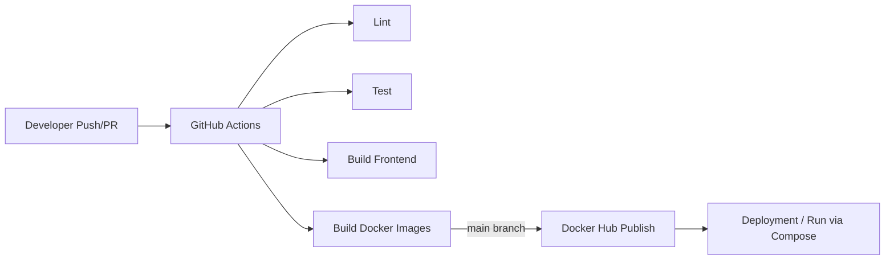

## Slide 1: Introduction to CI/CD
- CI/CD (Continuous Integration / Continuous Delivery) automates build, test, and release steps.
- Goal: ship small changes safely and frequently with consistent quality gates.
- In SkillSwap, CI validates code, and CD publishes Docker images on `main`.
- Continuous Integration focuses on merging often and detecting issues early.
- Continuous Delivery ensures every change is releasable, not necessarily auto-deployed.
- Benefits: faster feedback, fewer regressions, repeatable releases.

## Slide 2: Tools Used (with roles explained)
- GitHub Actions: pipeline orchestration and workflow automation.
- Docker: containerizes backend and frontend apps.
- Docker Compose: local multi-service orchestration (frontend, backend, MongoDB).
- Node.js / npm: dependency management, scripts, linting, and tests.
- Jest + Supertest: backend unit/integration tests.
- Vitest + React Testing Library: frontend component tests.
- Docker Hub: image registry for published builds.
- ESLint: static checks to keep code style and catch errors.
- Nginx (frontend image): serves the production build efficiently.

## Slide 3: CI/CD Architecture Diagram

- PRs run validation jobs to block broken changes before merge.
- Main branch triggers image publishing for deployment-ready artifacts.
- Docker images provide the same runtime across dev, CI, and production.

## Slide 4: Installation Steps Summary
### Local (manual)
1) `cd backend` -> `cp .env.example .env` -> `npm install` -> `npm run dev`
2) `cd frontend` -> `cp .env.example .env` -> `npm install` -> `npm run dev`
3) Optional seed: `cd backend` -> `npm run seed`
- Local mode is best for rapid frontend or backend iteration.
- Ensure MongoDB is running locally when not using Docker.

### Docker (recommended)
1) `docker-compose up --build`
2) Open: `http://localhost:3000`
3) Optional seed: `docker exec -it skillswap-backend npm run seed`
- Docker mode provides full-stack parity with CI and deployment.
- Uploaded PDFs are stored in the backend container volume.

## Slide 5: Pipeline Implementation Flow
```text
Code Push / Pull Request
	-> Install Backend Dependencies
	-> Backend Lint
	-> Backend Tests
	-> Install Frontend Dependencies
	-> Frontend Lint
	-> Frontend Tests
	-> Frontend Build
	-> Build Docker Images
	-> If main: Push Images to Docker Hub
```
- Linting runs before tests to fail fast on style and syntax issues.
- Tests validate API behavior and UI components separately.
- Image tags include `latest` and commit SHA for traceability.

## Slide 6: Screenshots of Key Stages
- GitHub Actions workflow run (lint + tests)
- Docker image build logs (backend + frontend)
- Docker Hub published tags (`latest`, `<commit-sha>`)
- Local Docker Compose running services
Note: Add screenshots from your Actions tab and Docker Hub repo.
- Suggested images: workflow summary, job details, and Docker Hub repository page.
- Optional: include a screenshot of successful test output.

## Slide 7: Use Case Demonstration
- User registers and logs in.
- Teacher creates a skill course with outcomes and lessons.
- Learner browses marketplace and requests a booking.
- Teacher accepts and shares a learning resource link.
- Learner completes session; credits transfer; review is submitted.
- Demo shows both learner and teacher flows to highlight two-sided workflow.
- Emphasize the credit transfer as the key business rule.

## Slide 8: Challenges & Resolutions
- Environment parity: solved with Dockerized services and Compose.
- Failing CI tests: stabilized by running backend and frontend tests separately.
- Secrets management: stored GitHub Actions secrets for Docker Hub and JWT.
- Build-time env for Vite: documented required `VITE_API_URL` during image build.
- Image publishing permissions: fixed with Docker Hub access token.
- CI speed: improved by caching npm dependencies (optional).

## Slide 9: Conclusion & Q&A
- CI/CD reduces risk, improves reliability, and shortens feedback loops.
- SkillSwap pipeline enforces code quality and automates image publishing.
- Q&A
- Future: add staging environment and deployment approvals.
